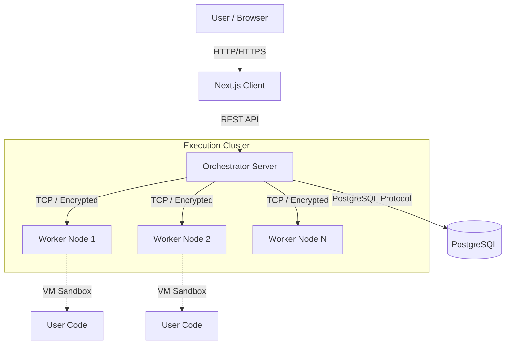

# System Architecture

Distribute PS Platform is designed as a distributed system that decouples the **Request Handling** (Orchestrator) from the **Code Execution** (Workers). This ensures scalability, security, and fault tolerance.

## High-Level Overview

## Components

### 1. Frontend (Client)
- **Tech**: Next.js 16, React 19, Tailwind CSS.
- **Role**: Provides the user interface for coding, submitting solutions, and viewing results.
- **Interaction**: Communicates solely with the Orchestrator via HTTP APIs.

### 2. Orchestrator (Server)
- **Tech**: Node.js, Express.
- **Role**: The central brain of the system.
    - **Auth**: Manages user sessions (JWT).
    - **Task Management**: Fetches problems and test cases from the DB.
    - **Load Balancing**: Splits test cases into chunks and distributes them to available workers.
    - **Aggregation**: Collects results from workers and determines the final pass/fail status.
- **Security**: Encrypts payloads before sending them to workers using AES-256.

### 3. Worker Nodes
- **Tech**: Node.js (Net module, VM module).
- **Role**: Stateless execution units.
    - **Listening**: Listens on a specific TCP port.
    - **Decryption**: Decrypts incoming payloads using a shared secret.
    - **Execution**: Runs untrusted user code in a `vm` context (sandbox) with a timeout.
    - **Reporting**: Sends execution results (pass/fail, duration, logs) back to the Orchestrator.

### 4. Database
- **Tech**: PostgreSQL.
- **Role**: Persistent storage.
    - `users`: User profiles and auth data.
    - `problems`: Coding problem definitions and starter code.
    - `test_cases`: Input/Output pairs for validation.
    - `submissions`: History of user attempts.
    - `submission_results`: Detailed logs of every test case run.

## Execution Flow

1. **Submission**: User clicks "Submit". Code + Problem ID is sent to Orchestrator.
2. **Preprocessing**: Orchestrator fetches e.g. 50 test cases for the problem.
3. **Splitting**: If 5 workers are active, the 50 cases are split into 5 chunks of 10.
4. **Encryption**: Each chunk + User Code is bundled into a JSON payload and encrypted.
5. **Dispatch**: Encrypted payloads are sent via TCP to workers.
6. **Processing**: Workers run the code against their assigned 10 test cases.
7. **Result Return**: Workers return a JSON array of results.
8. **Aggregation**: Orchestrator combines all 50 results. If all pass, the status is "Accepted".

## Security Measures

- **Transport Security**: Custom AES encryption over TCP ensures that code and test data cannot be snooped on the internal network.
- **Sandboxing**: `vm.runInContext` isolates user code execution.
- **Timeouts**: Execution is capped (e.g., 1000ms) to prevent infinite loops from freezing a worker.
